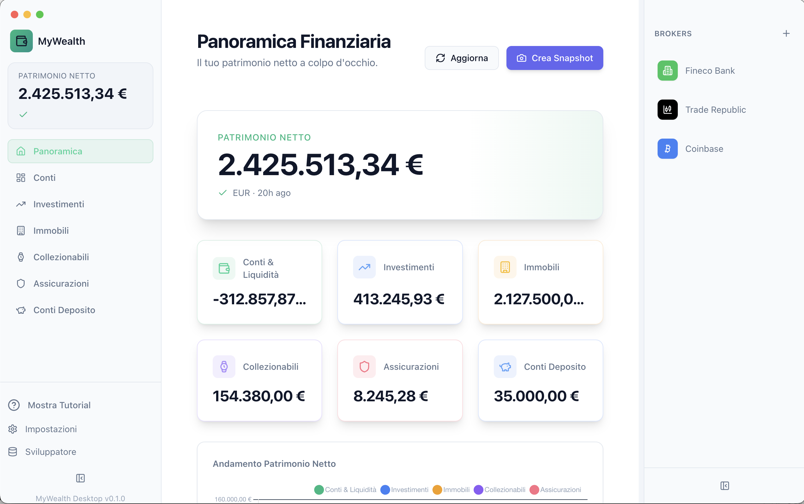

# My Wealth 💰

**My Wealth** is a modern, open-source, local-first personal finance application designed to give you complete control over your financial data. Built with privacy at its core, it allows you to track investments, accounts, real estate, and collectibles without your sensitive data ever leaving your device.



## ✨ Key Features

*   **🔒 Local-First & Private**: Your financial data is stored securely on your local machine. No cloud servers, no tracking, no data selling. You own your data.
*   **📈 Investment Portfolio**: 
    *   Real-time price updates via Yahoo Finance integration.
    *   Track Stocks, ETFs, Cryptocurrencies, and more.
    *   Visual portfolio distribution with interactive charts.
    *   Detailed performance metrics including Day Change, Total Return, and Cost Basis.
    *   Support for buy/sell transactions with automatic P/L calculation.
*   **🏦 Comprehensive Net Worth Tracking**:
    *   **Accounts**: Manage bank accounts, cash, and liabilities.
    *   **Real Estate**: Track property values and mortgages.
    *   **Collectibles**: Manage high-value assets like watches, art, jewelry, and vehicles.
*   **📊 Insightful Dashboard**: A beautiful, responsive interface that gives you an at-a-glance view of your financial health.
*   **⚡ Modern & Fast**: Built with cutting-edge web technologies for a native application experience.

## 🛠️ Tech Stack

*   **Core**: [Electron](https://www.electronjs.org/), [React](https://react.dev/), [TypeScript](https://www.typescriptlang.org/)
*   **Styling**: [Tailwind CSS](https://tailwindcss.com/)
*   **State Management**: [Zustand](https://github.com/pmndrs/zustand)
*   **Charts**: [Recharts](https://recharts.org/) & [Chart.js](https://www.chartjs.org/)
*   **Data Validation**: [Zod](https://zod.dev/)
*   **Build Tooling**: [Electron-Vite](https://electron-vite.org/)

## 🚀 Getting Started

### Prerequisites

*   Node.js (v18 or higher recommended)
*   npm or yarn

### Installation

1.  Clone the repository:
    ```bash
    git clone https://github.com/marcomedri/my-wealth.git
    cd my-wealth
    ```

2.  Install dependencies:
    ```bash
    npm install
    ```

3.  Start the development server:
    ```bash
    npm run dev
    ```

## 📦 Building for Production

To build the application for your operating system:

**macOS**
```bash
npm run build:mac
```

**Windows**
```bash
npm run build:win
```

**Linux**
```bash
npm run build:linux
```

## 🤝 Contributing

Contributions are what make the open source community such an amazing place to learn, inspire, and create. Any contributions you make are **greatly appreciated**.

1.  Fork the Project
2.  Create your Feature Branch (`git checkout -b feature/AmazingFeature`)
3.  Commit your Changes (`git commit -m 'Add some AmazingFeature'`)
4.  Push to the Branch (`git push origin feature/AmazingFeature`)
5.  Open a Pull Request

## 📄 License

Distributed under the MIT License. See `LICENSE` for more information.

---

<p align="center">
  Built with ❤️ by Marco Medri
</p>
