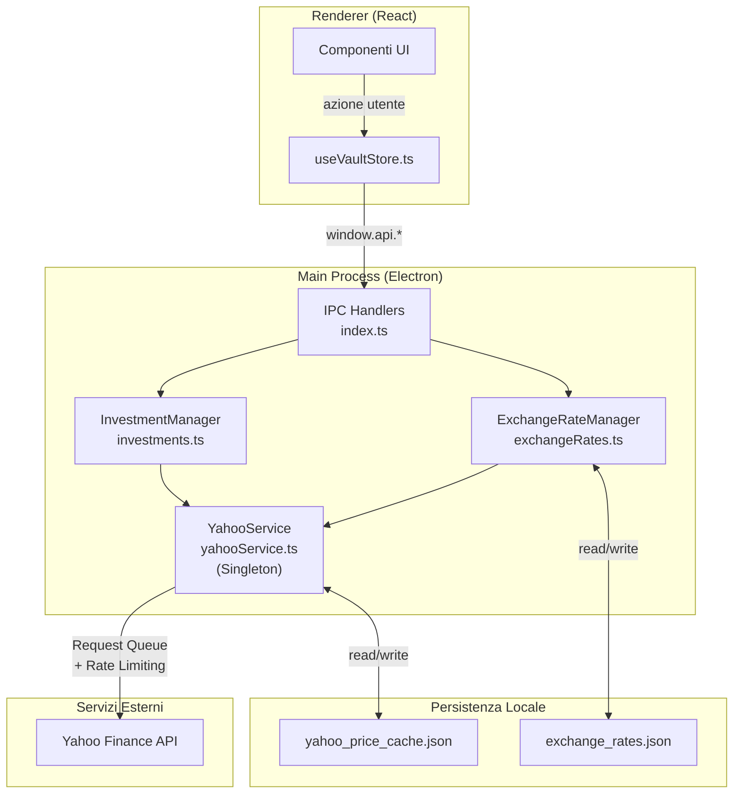
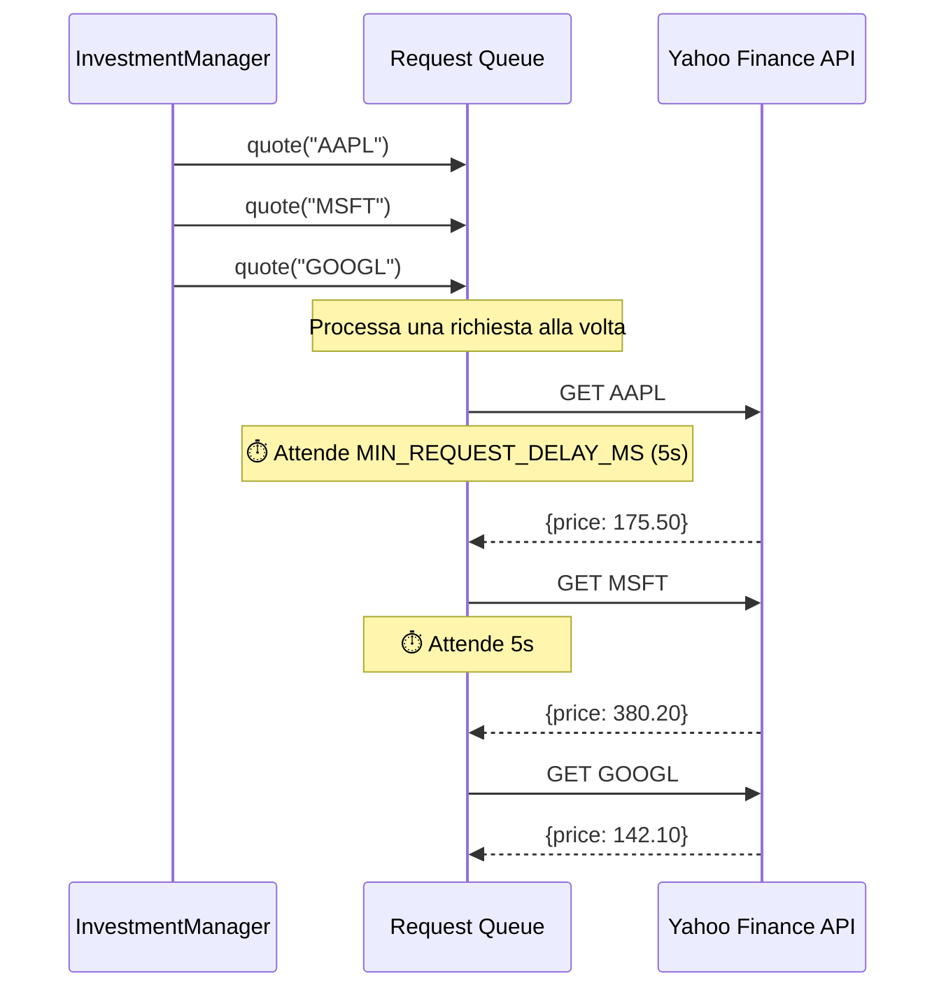
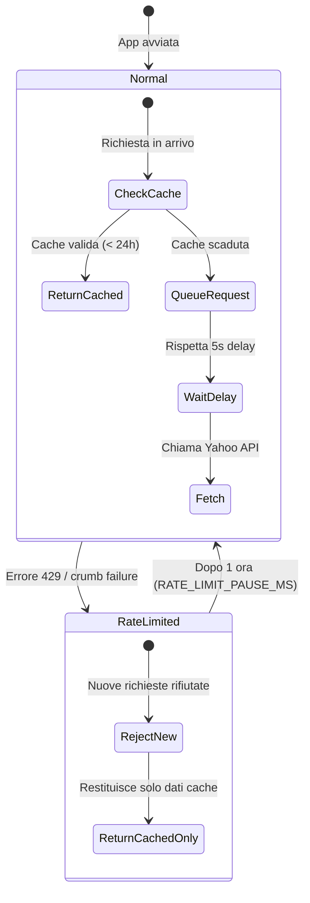
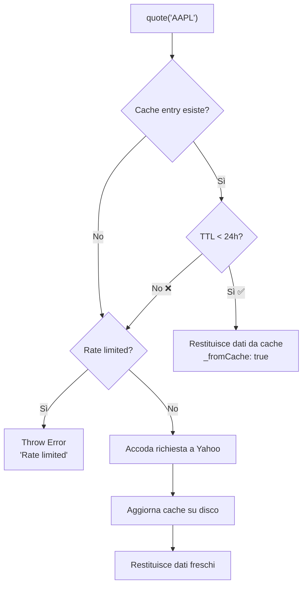
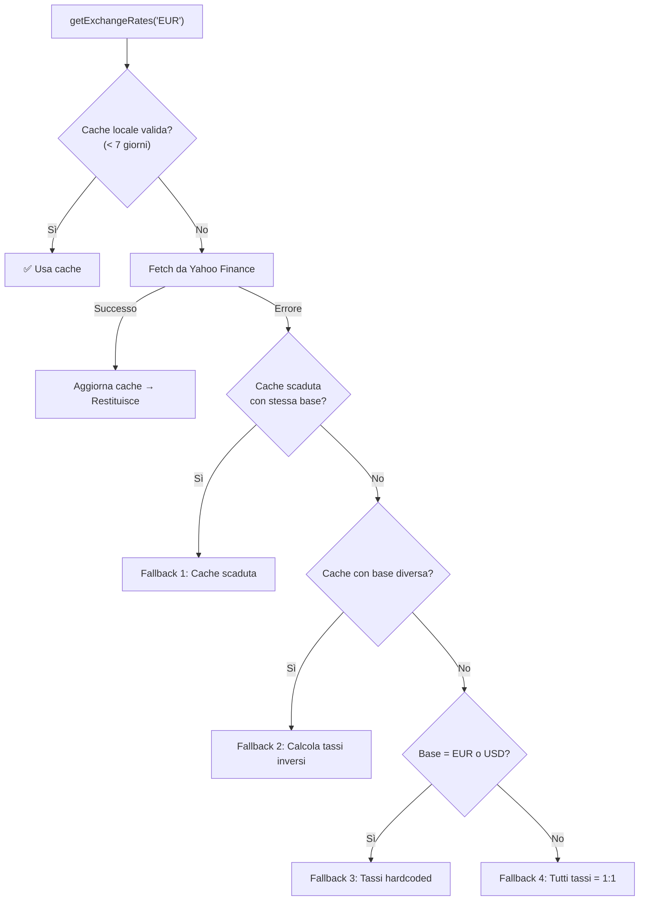
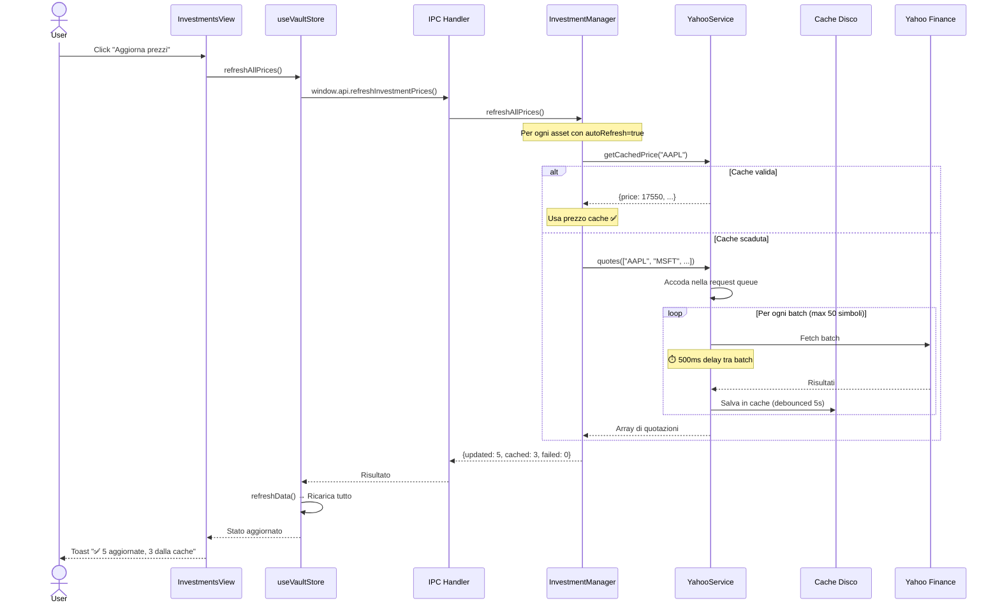
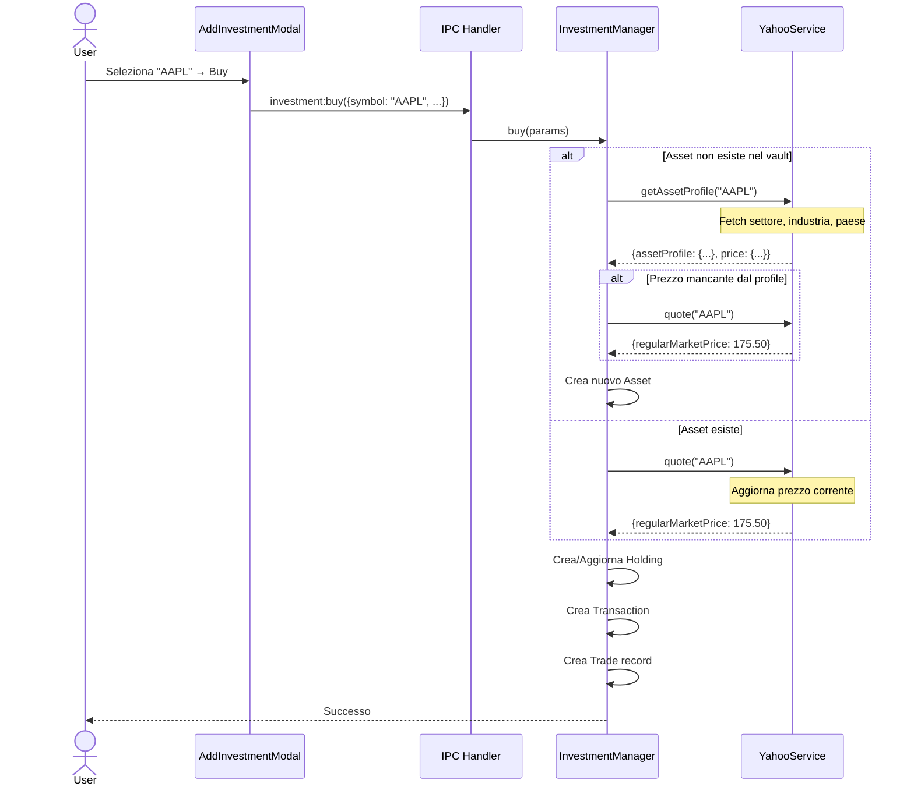

# Yahoo Finance Integration — Architettura e Anti-Rate-Limit

Documento tecnico che descrive come MyWealth comunica con Yahoo Finance, i meccanismi di protezione contro il rate-limiting (errore `429 Too Many Requests`), e come funziona il sistema di caching.

---

## Indice

1. [Panoramica Architettura](#1-panoramica-architettura)
2. [YahooService — Il Singleton Centralizzato](#2-yahooservice--il-singleton-centralizzato)
3. [Request Queue — Serializzazione delle Chiamate](#3-request-queue--serializzazione-delle-chiamate)
4. [Rate Limit Detection & Backoff](#4-rate-limit-detection--backoff)
5. [Disk-Based Price Caching](#5-disk-based-price-caching)
6. [Exchange Rates — Tassi di Cambio](#6-exchange-rates--tassi-di-cambio)
7. [Flusso Dati End-to-End](#7-flusso-dati-end-to-end)
8. [Come Evitare l'errore "Too Many Requests"](#8-come-evitare-lerrore-too-many-requests)
9. [Costanti e Parametri Chiave](#9-costanti-e-parametri-chiave)
10. [File Coinvolti](#10-file-coinvolti)

---

## 1. Panoramica Architettura



> [!IMPORTANT]
> **Tutte** le chiamate a Yahoo Finance passano attraverso il singleton `YahooService`. Nessun altro modulo deve chiamare direttamente la libreria `yahoo-finance2`.

---

## 2. YahooService — Il Singleton Centralizzato

**File**: [yahooService.ts](file:///Users/marcomedri/Documents/Progetti/My%20Wealth/src/main/yahooService.ts)

`YahooService` è una classe singleton che wrappa la libreria `yahoo-finance2` aggiungendo tre livelli di protezione:

| Layer | Descrizione |
|-------|-------------|
| **Request Queue** | Tutte le richieste sono serializzate (una alla volta) |
| **Rate Limit Detection** | Intercetta errori 429 / crumb failure e attiva un backoff |
| **Disk Cache** | Salva i prezzi su file JSON con TTL di 24 ore |

### Inizializzazione

```typescript
// Singleton — unica istanza in tutta l'app
const yahooService = getYahooService();

// La prima chiamata a qualsiasi metodo pubblico chiama init()
// che carica la cache da disco
await yahooService.init();
```

### API Pubblica

| Metodo | Descrizione | Cache? |
|--------|-------------|--------|
| `search(query)` | Ricerca ticker | ❌ No |
| `quote(symbol)` | Prezzo singolo | ✅ Sì (24h) |
| `quotes(symbols[])` | Prezzi multipli in batch | ✅ Sì (24h) |
| `getAssetProfile(symbol)` | Settore, industria, paese | ❌ No |
| `isRateLimited()` | Controlla se siamo bloccati | — |
| `getCachedPrice(symbol)` | Legge cache senza fetch | — |
| `getCacheStats()` | Statistiche cache | — |
| `clearCache()` | Pulisce tutta la cache | — |

---

## 3. Request Queue — Serializzazione delle Chiamate

Yahoo Finance è **molto aggressivo** con il rate limiting. Per questo, tutte le chiamate API vengono accodate e eseguite **una alla volta** con un delay minimo tra ogni richiesta.



### Come funziona il processamento della coda

```typescript
// Pseudocodice del loop di processamento (processQueue)
while (queue.length > 0) {
  // 1. Se siamo rate-limited → aspetta fino alla fine del blocco
  if (isRateLimited()) await sleep(rateLimitedUntil - now);

  // 2. Rispetta il delay minimo tra richieste (5 secondi)
  const elapsed = now - lastRequestTime;
  if (elapsed < MIN_REQUEST_DELAY_MS) await sleep(MIN_REQUEST_DELAY_MS - elapsed);

  // 3. Esegui la richiesta
  lastRequestTime = Date.now();
  const result = await request.execute();

  // 4. Se errore 429 → attiva backoff di 1 ora
  if (isRateLimitError(error)) {
    rateLimitedUntil = Date.now() + RATE_LIMIT_PAUSE_MS;
  }
}
```

> [!NOTE]
> Il flag `isProcessingQueue` garantisce che solo un loop di processamento sia attivo. Nuove richieste si accodano senza duplicare il processing.

---

## 4. Rate Limit Detection & Backoff

### Cosa viene intercettato come "rate limit"

```typescript
private isRateLimitError(error: unknown): boolean {
  const msg = error.message.toLowerCase();
  return msg.includes('429') ||
         msg.includes('too many requests') ||
         msg.includes('rate limit') ||
         msg.includes('failed to get crumb'); // ← Anche il crumb failure!
}
```

> [!WARNING]
> Yahoo Finance non restituisce sempre un HTTP 429 classico. A volte **invalida il crumb/cookie** causando un errore `failed to get crumb`. Questo viene trattato come rate limit perché è un segnale che Yahoo sta bloccando le nostre richieste.

### Cosa succede quando scatta il rate limit



**Parametri di backoff:**

| Evento | Azione | Durata |
|--------|--------|--------|
| Errore 429 / crumb failure | Blocca **tutte** le richieste | **1 ora** (`RATE_LIMIT_PAUSE_MS`) |
| Tra una richiesta e l'altra | Delay obbligatorio | **5 secondi** (`MIN_REQUEST_DELAY_MS`) |

### Protezione pre-fetch

Prima di accodare una richiesta, il metodo `quote()` controlla **subito** se siamo in rate limit:

```typescript
if (this.isRateLimited()) {
  throw new Error(`Yahoo Finance rate limited. Try again in ${remainingMinutes} minutes.`);
}
```

Questo evita di accodare richieste che sappiamo già fallirebbero.

---

## 5. Disk-Based Price Caching

### Struttura del file cache

**Path**: `{userData}/yahoo_price_cache.json`

```json
{
  "version": 1,
  "entries": {
    "AAPL": {
      "price": 17550,
      "previousClose": 17420,
      "timestamp": 1707600000000,
      "currency": "USD"
    },
    "MSFT": {
      "price": 38020,
      "previousClose": 37890,
      "timestamp": 1707600000000,
      "currency": "USD"
    }
  }
}
```

> [!NOTE]
> I prezzi sono salvati **in centesimi** (cents) per evitare errori di floating point. `17550` = `$175.50`.

### Flusso di lettura cache



### Save Debouncing

La cache non viene scritta a ogni aggiornamento. Un timer di **5 secondi** raggruppa le scritture:

```typescript
private savePriceCacheDebounced(): void {
  clearTimeout(this.saveDebounceTimer);
  this.saveDebounceTimer = setTimeout(() => {
    this.savePriceCache(); // Scrittura effettiva su disco
  }, 5000);
}
```

---

## 6. Exchange Rates — Tassi di Cambio

**File**: [exchangeRates.ts](file:///Users/marcomedri/Documents/Progetti/My%20Wealth/src/main/exchangeRates.ts)

I tassi di cambio usano Yahoo Finance con il formato `EURUSD=X` e hanno un caching **molto più lungo** (7 giorni) per minimizzare le chiamate.

### Strategia di Fallback (3 livelli)



> [!TIP]
> Con un TTL di 7 giorni e i fallback a 3 livelli, l'app funziona anche **completamente offline** per i tassi di cambio.

---

## 7. Flusso Dati End-to-End

### Scenario: Utente clicca "Aggiorna prezzi"



### Scenario: Acquisto di un nuovo titolo



---

## 8. Come Evitare l'errore "Too Many Requests"

### Meccanismi già implementati

| # | Meccanismo | Dove | Effetto |
|---|-----------|------|---------|
| 1 | **Request Queue** | `yahooService.ts` | Una sola richiesta alla volta |
| 2 | **Delay 5s tra richieste** | `processQueue()` | Max 12 richieste/minuto |
| 3 | **Backoff 1 ora su 429** | `processQueue()` | Blocco totale dopo errore |
| 4 | **Cache 24h su disco** | `getCachedPrice()` | Evita richieste duplicate |
| 5 | **Cache 7 giorni per exchange rates** | `exchangeRates.ts` | Minimizza chiamate currency |
| 6 | **Pre-check rate limit** | `quote()`, `quotes()` | Reject immediato senza accodare |
| 7 | **Batch fetch (max 50 simboli)** | `quotes()` | Una chiamata per molti ticker |
| 8 | **500ms delay tra batch** | `quotes()` | Gentilezza tra batch |
| 9 | **Save debounce 5s** | `savePriceCacheDebounced()` | Riduce I/O disco |
| 10 | **autoRefresh flag** | `Asset.autoRefresh` | Esclude asset manuali |

### Best Practices per sviluppatori

> [!CAUTION]
> **Non usare MAI** `yahoo-finance2` direttamente. Usa sempre `getYahooService()` per garantire che tutte le protezioni siano attive.

```typescript
// ❌ MAI FARE QUESTO
import yahooFinance from 'yahoo-finance2';
const quote = await yahooFinance.quote('AAPL'); // ← Bypassa la coda!

// ✅ CORRETTO
import { getYahooService } from './yahooService';
const yahooService = getYahooService();
const quote = await yahooService.quote('AAPL');
```

### Cosa fare se l'utente vede "Rate Limited"

1. **Aspettare** — Il blocco dura 1 ora (`RATE_LIMIT_PAUSE_MS`)
2. **Usare la cache** — I dati degli ultimi 24h sono ancora disponibili
3. **Non spammare il bottone refresh** — Ogni click genera nuove richieste

### Possibili miglioramenti futuri

| Miglioramento | Impatto |
|--------------|---------|
| Exponential backoff invece di 1h fisso | Recupero più veloce |
| Backoff progressivo (5min → 15min → 1h) | Meno aggressivo |
| Ridurre `RATE_LIMIT_PAUSE_MS` a 30 minuti | Test necessari |
| WebSocket / real-time feed (richiede abbonamento) | Elimina polling |
| Caching condiviso tra sessioni di diversi utenti | Non applicabile (app desktop locale) |

---

## 9. Costanti e Parametri Chiave

| Costante | Valore | File | Descrizione |
|----------|--------|------|-------------|
| `MIN_REQUEST_DELAY_MS` | `5000` (5s) | `yahooService.ts:45` | Delay minimo tra richieste |
| `RATE_LIMIT_PAUSE_MS` | `3600000` (1h) | `yahooService.ts:46` | Pausa dopo errore 429 |
| `PRICE_CACHE_TTL_MS` | `86400000` (24h) | `yahooService.ts:47` | Durata validità cache prezzi |
| `BATCH_SIZE` | `50` | `yahooService.ts:359` | Max simboli per batch |
| `CACHE_TTL` (exchange) | `604800000` (7 giorni) | `exchangeRates.ts:15` | Durata cache tassi cambio |
| `yahooTimeout` | `10000` (10s) | `config.ts:22` | Timeout per singola richiesta |
| `priceRefreshInterval` | `60000` / `300000` | `config.ts:24` | Intervallo refresh (prod/dev) |
| Save debounce | `5000` (5s) | `yahooService.ts:402` | Delay scrittura cache su disco |

---

## 10. File Coinvolti

| File | Ruolo |
|------|-------|
| [yahooService.ts](file:///Users/marcomedri/Documents/Progetti/My%20Wealth/src/main/yahooService.ts) | Singleton centralizzato per chiamate Yahoo Finance |
| [investments.ts](file:///Users/marcomedri/Documents/Progetti/My%20Wealth/src/main/investments.ts) | InvestmentManager — search, quote, buy, sell, refreshAllPrices |
| [exchangeRates.ts](file:///Users/marcomedri/Documents/Progetti/My%20Wealth/src/main/exchangeRates.ts) | ExchangeRateManager — tassi di cambio via Yahoo |
| [config.ts](file:///Users/marcomedri/Documents/Progetti/My%20Wealth/src/shared/config.ts) | Configurazione centralizzata (timeout, intervalli) |
| [errors.ts](file:///Users/marcomedri/Documents/Progetti/My%20Wealth/src/shared/errors.ts) | Classi errore tipizzate (`RateLimitError`) |
| [index.ts](file:///Users/marcomedri/Documents/Progetti/My%20Wealth/src/main/index.ts) | IPC handlers che espongono InvestmentManager al renderer |
| [useVaultStore.ts](file:///Users/marcomedri/Documents/Progetti/My%20Wealth/src/renderer/src/store/useVaultStore.ts) | Store Zustand — `refreshAllPrices()` chiama main process |

---

> *Documento generato l'11 febbraio 2026 — basato sul codice sorgente corrente.*
